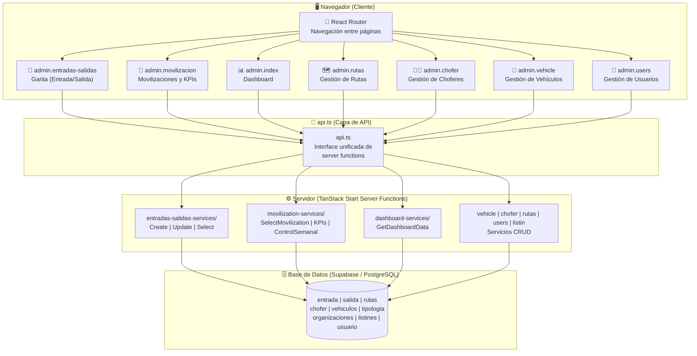
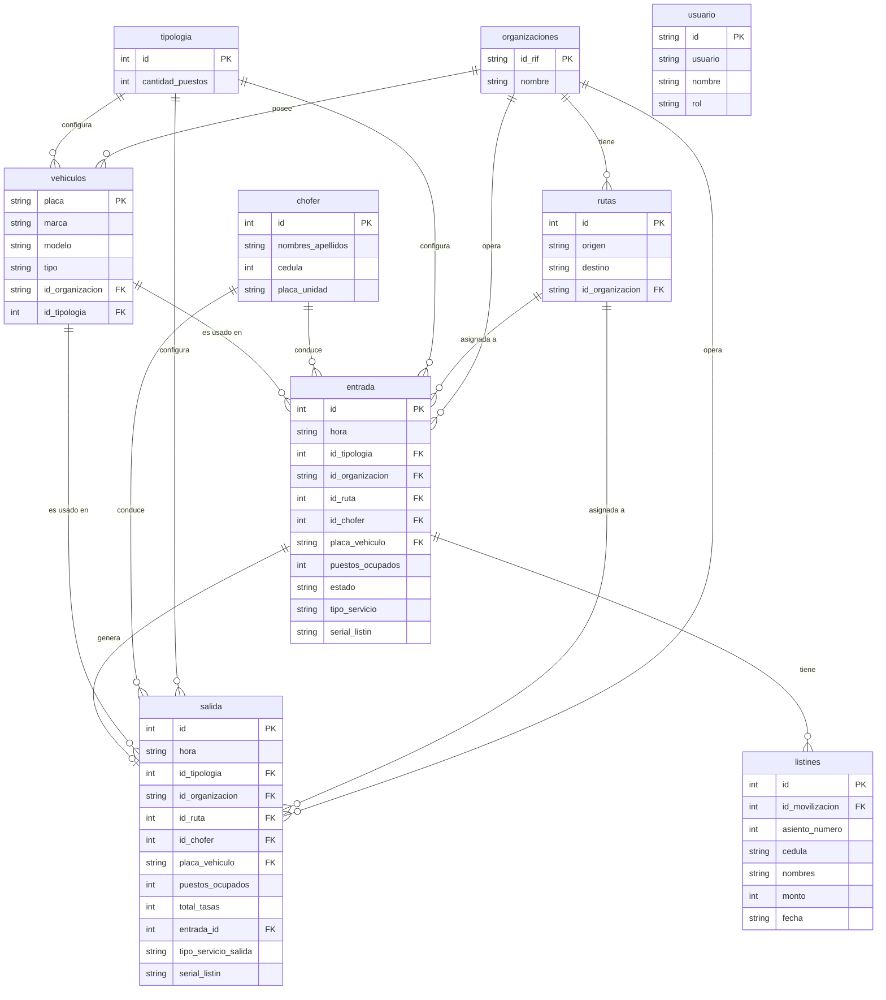
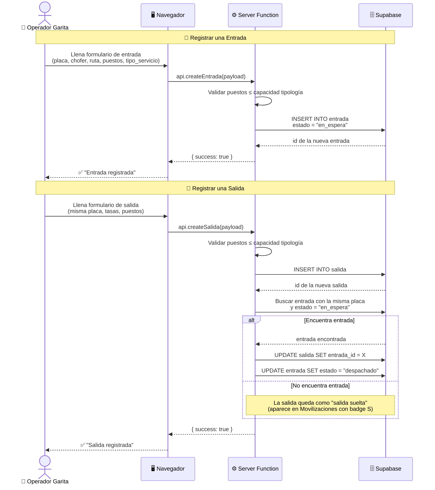

# Terminal Alí Primera — Sistema de Gestión

Sistema para administrar las operaciones diarias del **Terminal de Pasajeros Alí Primera**. Controla la entrada y salida de unidades, registra pasajeros, gestiona rutas, conductores y vehículos, y genera reportes operativos.

> Construido con **React + TypeScript** y **Supabase** como base de datos.

---

## 📖 Índice

- [¿Qué hace este sistema?](#qué-hace-este-sistema)
- [¿Cómo funciona? (para no programadores)](#cómo-funciona-para-no-programadores)
- [Arquitectura Técnica](#arquitectura-técnica)
- [Módulos del Sistema](#módulos-del-sistema)
- [Modelo de Datos](#modelo-de-datos)
- [Flujo de Operaciones](#flujo-de-operaciones)
- [Zona Horaria](#zona-horaria)
- [Autenticación y Roles](#autenticación-y-roles)
- [Despliegue](#despliegue)
- [Variables de Entorno](#variables-de-entorno)
- [Stack Tecnológico](#stack-tecnológico)
- [Diagramas UML](#diagramas-uml)

---

## 🧭 ¿Qué hace este sistema?

Imagina un terminal de pasajeros donde a diario entran y salen cientos de autobuses. Este sistema permite:

- **Registrar cada autobús que entra y sale** del terminal, con su placa, conductor, ruta y cantidad de pasajeros.
- **Saber en todo momento qué unidades están** en espera, en andén o en tránsito.
- **Clasificar los viajes** como suburbanos (cortos, locales) o interurbanos (larga distancia, otros estados).
- **Llevar la cuenta de pasajeros** que llegan (desembarque) y los que salen, junto con las tasas cobradas.
- **Administrar conductores, vehículos y rutas**, dándolos de alta, editándolos o eliminándolos.
- **Visualizar reportes** diarios, semanales y mensuales con gráficos y totales.
- **Controlar quién accede** al sistema mediante roles de usuario.

Todo desde una interfaz web moderna, rápida y accesible desde cualquier computadora con internet.

---

## 🧑‍🏫 ¿Cómo funciona? (para no programadores)

Piensa en el sistema como un **libro de control digital** con varias secciones:

### 📋 Garita (Entradas y Salidas)
Es como un **cuaderno de bitácora**. Cada vez que un autobús llega al terminal, el operador de garita **registra una entrada**: anota la placa, el conductor, cuántos pasajeros trajo (desembarque), la ruta que hizo y si el servicio es suburbano (local) o interurbano (larga distancia). Cuando el autobús se va, **registra una salida**: anota los mismos datos más las tasas cobradas.

El sistema intenta emparejar automáticamente cada salida con una entrada que tenga la misma placa, para llevar la trazabilidad del viaje. Pero también se puede registrar una salida sin entrada previa (por ejemplo, un autobús que inicia su ruta desde el terminal).

### 🚌 Movilizaciones
Es el **panel de control operativo**. Aquí se ve una lista combinada de todas las entradas y salidas del día o del mes. Cada fila tiene un badge que indica si es una **E** (Entrada, el bus llegó) o una **S** (Salida, el bus se fue). También se muestran indicadores como:
- **Total hoy**: cuántos eventos (entradas + salidas) han ocurrido.
- **Despachados**: cuántos buses han salido.
- **Usuarios totales**: la suma de pasajeros que llegaron (entrada) y los que se fueron (salida).
- **Vehículo más usado**: la placa del bus que más viajes ha hecho.

Además, hay una pestaña **Control Semanal** que agrupa los datos por fecha y muestra unidades, usuarios, desembarques y tasas recaudadas.

### 🗺️ Rutas
Es el **catálogo de destinos**. Aquí se configuran las rutas que operan en el terminal: origen, destino y a qué organización (empresa de transporte) pertenecen.

### 👨‍✈️ Conductores
Es el **registro de choferes**. Se almacena su nombre completo, cédula y la placa de la unidad que manejan.

### 🚛 Vehículos
Es el **inventario de autobuses**. Cada vehículo tiene placa, marca, modelo, tipo (encava, por puesto, colectivo) y capacidad de puestos.

### 👥 Usuarios
Son las **personas que pueden usar el sistema**: administradores (acceso total), gerentes y personal de garita. Cada uno tiene su nombre de usuario y contraseña.

---

## 🏗️ Arquitectura Técnica

El sistema usa una arquitectura **cliente-servidor moderna** donde el código de la interfaz (lo que ves en el navegador) se comunica con la base de datos a través de **funciones del servidor** (Server Functions). Esto significa que el navegador nunca habla directamente con la base de datos, sino que llama a funciones intermediarias que se ejecutan en el servidor.

### Flujo de una operación típica

Cuando un operador de garita registra una entrada:

```
1. El operador llena el formulario en el navegador
2. El navegador llama a una "server function" (CreateEntradaServer)
3. El servidor recibe los datos, los valida y los guarda en Supabase
4. Si todo sale bien, devuelve un "success"
5. El navegador muestra un mensaje de confirmación
```

Este diseño tiene ventajas importantes:
- **Seguridad**: la clave de la base de datos nunca se expone al navegador.
- **Validación centralizada**: las reglas de negocio (como "los puestos no pueden exceder la capacidad del vehículo") se aplican en el servidor, no solo en el navegador.
- **Menos errores**: al centralizar la lógica, es más fácil mantener y depurar.

### Diagrama de flujo

```
┌──────────────┐
│   Navegador  │  ← React + TypeScript
│   (Cliente)  │
└──────┬───────┘
       │  llama a server function
       ▼
┌──────────────┐
│   Servidor   │  ← TanStack Start
│  (Server FN) │
└──────┬───────┘
       │  consulta con service role key
       ▼
┌──────────────┐
│   Supabase   │  ← PostgreSQL
│  (Base datos)│
└──────┬───────┘
       │  devuelve datos
       ▼
┌──────────────┐
│   Servidor   │
└──────┬───────┘
       │  respuesta formateada
       ▼
┌──────────────┐
│   Navegador  │  ← renderiza resultado
└──────────────┘
```

### Estructura del proyecto

```
src/
├── components/          # Piezas de interfaz reutilizables (botones, tablas, etc.)
│   └── ui/              # Componentes base (shadcn/ui)
├── routes/              # Las páginas del sistema (Dashboard, Garita, etc.)
├── lib/
│   ├── api.ts           # El "menú" de funciones que el navegador puede llamar
│   └── services/        # Las funciones del servidor, organizadas por módulo
│       ├── entradas-salidas-services/  # Crear, editar, listar entradas y salidas
│       ├── movilization-services/      # Movilizaciones, KPIs, control semanal
│       ├── vehicle-services/           # CRUD de vehículos
│       ├── chofer-services/            # CRUD de conductores
│       ├── rutas-services/             # CRUD de rutas
│       ├── users-services/             # CRUD de usuarios
│       ├── listin-services/            # Boletería
│       └── dashboard-services/         # Datos del Dashboard
├── server/
│   └── supabase.service.ts  # Conexión a la base de datos (solo servidor)
└── styles.css           # Estilos globales
```

---

## 📦 Módulos del Sistema

### 🚪 Garita — Entradas y Salidas (`/admin/entradas-salidas`)

Control de acceso de unidades al terminal. Permite:

- **Registrar entrada**: cuando un autobús llega, se registra con tipología (cantidad de puestos), organización, ruta, chofer, placa, desembarque (pasajeros que bajan), serial de listín y tipo de servicio (suburbano/interurbano).
- **Registrar salida**: cuando un autobús se va, se registran los mismos datos más las tasas cobradas. Si existe una entrada con la misma placa en estado "en espera", se vinculan automáticamente.
- **Editar registros**: cada fila tiene un botón ✏️ para corregir datos.
- **Resumen operativo**: panel lateral que muestra totales de unidades, pasajeros y tasas, separados por suburbanos e interurbanos.
- **Cierre de turno**: tarjeta con totales consolidados del período seleccionado.

### 🚌 Movilizaciones (`/admin/movilizacion`)

Panel de control y monitoreo. Dos vistas:

**Control Operativo:**
- Lista combinada de entradas y salidas, identificadas con badge **E** (azul) o **S** (naranja).
- KPIs del día: total movilizado, despachados, suspendidos, usuarios totales (entrada + salida), vehículo más usado.
- Filtro por hoy o por mes/año.
- Detalle de cada registro al hacer clic (ID, número de listín, hora de salida).
- Gráfico mensual de flujo de movilizaciones.

**Control Semanal:**
- KPIs consolidados del rango seleccionado: unidades, usuarios, desembarques, recaudación.
- Tabla detallada agrupada por fecha con desglose por unidad.
- Gráficos por tipología y tendencia semanal.
- Exportación a PDF.

### 🗺️ Rutas (`/admin/rutas`)

Catálogo de destinos. CRUD completo con búsqueda de organización por RIF (combobox).

### 👨‍✈️ Conductores (`/admin/chofer`)

Registro de choferes con búsqueda por nombre o cédula. CRUD completo.

### 🚛 Vehículos (`/admin/vehicle`)

Inventario de autobuses con asignación automática de puestos según el tipo. CRUD completo.

### 👥 Usuarios (`/admin/users`)

Gestión de acceso al sistema. CRUD completo con asignación de rol.

### 📊 Dashboard (`/admin`)

Resumen operativo con tarjetas de movilizaciones activas, vehículos operativos, choferes disponibles y rutas cubiertas. Gráficos de rutas más demandadas y horas pico. Últimas movilizaciones registradas.

---

## 💾 Modelo de Datos

El sistema utiliza **PostgreSQL** como base de datos, manejado a través de **Supabase**. Todas las tablas usan **soft delete** (marcan `deleted_at` en vez de borrar físicamente) para mantener el historial.

### Tablas principales

| Tabla | ¿Qué guarda? | Datos importantes |
|-------|-------------|-------------------|
| `entrada` | Registros de llegada de autobuses | hora de llegada, tipología, organización, ruta, chofer, placa, puestos ocupados (desembarque), tipo de servicio, serial de listín |
| `salida` | Registros de salida de autobuses | misma estructura que entrada, más total de tasas, enlace a la entrada por `entrada_id` |
| `vehiculos` | Autobuses registrados | placa, marca, modelo, tipo, propietario, organización |
| `tipologia` | Configuración de capacidad | cantidad de puestos (5, 20, 32, 60) |
| `chofer` | Conductores | nombre, cédula, placa de unidad asignada |
| `rutas` | Rutas de transporte | origen, destino, organización asociada |
| `organizaciones` | Empresas de transporte | RIF, nombre |
| `movilizaciones` | Consolidado diario | fecha, día, ruta, placa |
| `listines` | Boletería (tickets) | asiento, cédula, nombre, monto, destino |
| `usuario` | Usuarios del sistema | nombre de usuario, rol |

### Relaciones clave

| Relación | Descripción |
|----------|-------------|
| `salida.entrada_id → entrada.id` | Una salida puede estar vinculada a una entrada existente |
| `entrada.id_ruta → rutas.id` | Cada entrada/salida pertenece a una ruta |
| `entrada.id_tipologia → tipologia.id` | Cada registro tiene una capacidad de puestos |
| `vehiculos.id_organizacion → organizaciones.id_rif` | Un vehículo pertenece a una organización |

---

## 🔄 Flujo de Operaciones

### Ciclo típico de un autobús

```
1. 🚌 El autobús llega al terminal
       ↓
2. 📝 Se registra una ENTRADA en Garita
   - Placa, conductor, ruta, pasajeros que bajan (desembarque)
   - Tipo de servicio: suburbano o interurbano
   - Serial de listín (opcional)
   - Estado: "en_espera"
       ↓
3. 🅿️ El autobús espera en el terminal
       ↓
4. 🚀 El autobús sale del terminal
       ↓
5. 📝 Se registra una SALIDA en Garita
   - Mismos datos que la entrada, más tasas cobradas
   - Se vincula automáticamente con la entrada (por placa)
   - La entrada cambia a estado: "despachado"
       ↓
6. ✅ Aparece en Movilizaciones como "despachado"
```

También es posible registrar una **salida sin entrada** (autobús que inicia su recorrido desde el terminal). En ese caso, aparece en movilizaciones como un registro tipo **S** (salida suelta).

### Clasificación suburbano / interurbano

| Tipo | Descripción | Ejemplos |
|------|-------------|----------|
| **Suburbano** | Rutas locales dentro del estado Falcón | Judibana, Santa Elena, Cardón, Las Piedras, Los Taques, Adícora, Pueblo Nuevo, La Vela |
| **Interurbano** | Rutas a otros estados o ciudades lejanas | Caracas, Maracaibo, Valencia, Barquisimeto, Portuguesa, Lara, etc. |

El usuario puede seleccionar manualmente el tipo de servicio en el formulario. Si no se selecciona, el sistema lo deduce según el destino.

---

## 🕐 Zona Horaria

Todo el sistema opera en la zona horaria **America/Caracas** (UTC -4). Las horas se registran con el offset `-04:00` y se muestran siempre en hora de Venezuela, independientemente de la ubicación del servidor o del navegador.

---

## 🔐 Autenticación y Roles

El sistema usa **Supabase Auth** para la autenticación. Los usuarios se guardan en una tabla local (`usuario`) y se mapean a cuentas de Supabase Auth mediante un email virtual.

### Roles

| Rol | Acceso |
|-----|--------|
| **admin** | Acceso completo a todas las secciones |
| **gerente** | Acceso operativo (dashboard, movilizaciones, reportes) |
| **garita** | Solo registro de entradas y salidas |

### Flujo de inicio de sesión

1. El usuario ingresa su nombre de usuario y contraseña
2. El servidor valida las credenciales contra Supabase Auth
3. Se genera un token JWT que se almacena en el navegador
4. Al cargar la aplicación, se verifica automáticamente la sesión

---

## 🚀 Despliegue

### Requisitos

- **Node.js** >= 18
- **Bun** (recomendado) o **npm**
- Una cuenta en **Supabase** con las tablas creadas

### Instalación

```bash
# Clonar el repositorio
git clone <url-del-repo>
cd al-primera-terminal-manager-main

# Instalar dependencias
bun install

# Configurar variables de entorno
# Editar el archivo .env con las credenciales de Supabase

# Iniciar en modo desarrollo
bun run dev
```

### Construir para producción

```bash
bun run build
```

El resultado se genera en la carpeta `dist/`.

---

## 🔧 Variables de Entorno

```env
# URL del proyecto en Supabase
VITE_SUPABASE_URL=https://xxxxxxxxxxxx.supabase.co

# Llave pública (cliente) — solo para el navegador
VITE_SUPABASE_PUBLISHABLE_KEY=eyJhbGciOiJIUzI1NiIs...

# Llave de servicio (servidor) — usada por las funciones del servidor
# Esta llave NUNCA se expone al navegador
SUPABASE_ROLE_KEY=eyJhbGciOiJIUzI1NiIs...
```

---

## 🛠️ Stack Tecnológico

### Frontend (lo que ves en el navegador)

| Tecnología | Para qué sirve |
|------------|----------------|
| **React 19** | Biblioteca para construir la interfaz de usuario |
| **TypeScript** | Lenguaje que añade tipos a JavaScript (menos errores) |
| **TanStack Router** | Sistema de navegación entre páginas |
| **TanStack Start** | Marco de trabajo que conecta el frontend con el servidor |
| **Tailwind CSS** | Sistema de estilos (colores, tamaños, espacios) |
| **shadcn/ui** | Colección de componentes visuales (tablas, botones, formularios) |
| **Recharts** | Biblioteca para gráficos (barras, líneas) |
| **jsPDF** | Generación de documentos PDF |
| **Lucide React** | Paquete de iconos |

### Backend (el motor del sistema)

| Tecnología | Para qué sirve |
|------------|----------------|
| **TanStack Start Server Functions** | Funciones que se ejecutan en el servidor cuando el navegador las llama |
| **Supabase JS Client** | Cliente para conectarse a la base de datos |
| **Bun / Node.js** | Entorno de ejecución (donde corre el servidor) |

### Base de Datos

| Tecnología | Para qué sirve |
|------------|----------------|
| **Supabase (PostgreSQL)** | Base de datos donde se guarda toda la información |
| **Service Role Key** | Llave especial que permite al servidor hacer cualquier operación |

---

## 📐 Diagramas UML

### Diagrama de Casos de Uso

```mermaid
graph TD
    subgraph Actores
        A1["🧑‍💼 Admin<br/>(Acceso total)"]
        A2["📋 Gerente<br/>(Operaciones)"]
        A3["🚪 Garita<br/>(Registro de entradas/salidas)"]
    end

    subgraph "Casos de Uso"
        U1["🔐 Iniciar Sesión"]
        U2["📊 Ver Dashboard"]
        U3["🚌 Registrar Entrada"]
        U4["🚀 Registrar Salida"]
        U5["✏️ Editar Entrada / Salida"]
        U6["📋 Ver Movilizaciones"]
        U7["📈 Control Semanal"]
        U8["📄 Exportar PDF"]
        U9["🗺️ Gestionar Rutas"]
        U10["👨‍✈️ Gestionar Choferes"]
        U11["🚛 Gestionar Vehículos"]
        U12["👥 Gestionar Usuarios"]
        U13["🎫 Boletería (Listines)"]
    end

    A1 --> U1
    A1 --> U2
    A1 --> U3
    A1 --> U4
    A1 --> U5
    A1 --> U6
    A1 --> U7
    A1 --> U8
    A1 --> U9
    A1 --> U10
    A1 --> U11
    A1 --> U12
    A1 --> U13

    A2 --> U1
    A2 --> U2
    A2 --> U6
    A2 --> U7
    A2 --> U8

    A3 --> U1
    A3 --> U3
    A3 --> U4
    A3 --> U5
```



### Diagrama de Componentes (Arquitectura)



### Diagrama Entidad-Relación (Base de Datos)



### Diagrama de Secuencia — Entrada y Salida



---

## 📄 Licencia

Uso interno — Terminal de Pasajeros Alí Primera.
