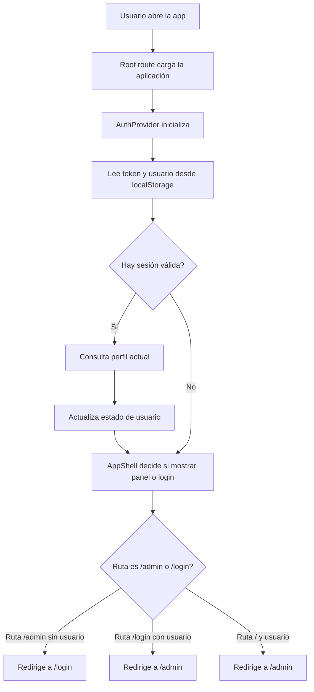
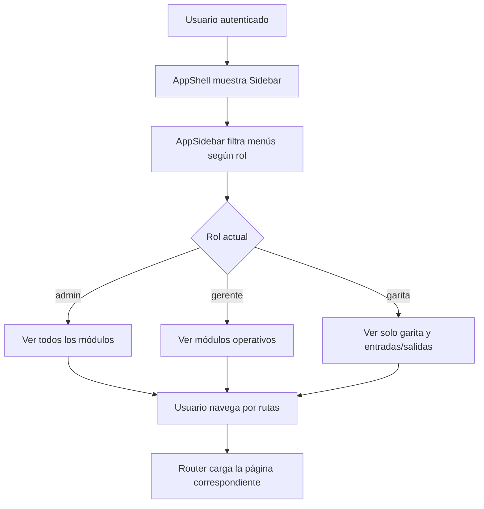

# Diagramas de flujo del sistema

## 1. Flujo general de arranque y autenticación



## 2. Flujo de login y redirección por rol

```mermaid
flowchart TD
    A[Usuario ingresa usuario y contraseña] --> B[LoginPage onSubmit]
    B --> C[useAuth.login()]
    C --> D[api.login()]
    D --> E[AuthController / servicio de login]
    E --> F[Supabase Auth signInWithPassword]
    F --> G{Login correcto?}
    G -- Sí --> H[Guardar token + usuario en localStorage]
    H --> I[Actualizar contexto de auth]
    I --> J[Mostrar bienvenida]
    J --> K{Rol del usuario}
    K -- garita --> L[Ir a /admin/entradas-salidas]
    K -- otro rol --> M[Ir a /admin]
    G -- No --> N[Mostrar error toast]
```

## 3. Flujo del módulo de Entradas / Salidas

```mermaid
flowchart TD
    A[Usuario entra a /admin/entradas-salidas] --> B[Carga registros por fecha]
    B --> C[api.selectEntradasSalidas()]
    C --> D[Servicio consulta entradas/salidas]
    D --> E[Render tabla + resumen]
    E --> F[Carga catálogos]
    F --> G[Tipologías, organizaciones, rutas, choferes, vehículos]

    H[Usuario crea entrada o salida] --> I[Validar formulario]
    I --> J{Es válida?}
    J -- No --> K[Mostrar toast de error]
    J -- Sí --> L[Preparar payload]
    L --> M{Tipo = salida?}
    M -- Sí --> N[api.createSalida()]
    M -- No --> O[api.createEntrada()]

    N --> P{Salida quedó sin entrada vinculada?}
    P -- Sí --> Q[Mostrar modal para hora de entrada]
    Q --> R[api.vincularSalidaSuelta()]
    P -- No --> S[Recargar tabla]

    O --> S
    R --> S
    S --> T[Actualizar resumen y cierres]
```

## 4. Flujo del panel administrativo (sidebar y roles)



## 5. Flujo del dashboard y resumen operativo

```mermaid
flowchart TD
    A[Usuario abre /admin] --> B[AdminDashboard carga]
    B --> C[api.getDashboardData()]
    C --> D[Servicio consulta métricas]
    D --> E[Movilizaciones activas]
    D --> F[Vehículos operativos]
    D --> G[Choferes disponibles]
    D --> H[Rutas cubiertas]
    D --> I[Top rutas y horas pico]
    D --> J[Últimas movilizaciones]
    E --> K[Render tarjetas resumen]
    F --> K
    G --> K
    H --> K
    I --> L[Render gráficos]
    J --> M[Render tabla reciente]
```

## 6. Flujo de gestión de movilizaciones

```mermaid
flowchart TD
    A[Usuario abre /admin/movilizacion] --> B[Carga filtros de fecha y mes]
    B --> C[api.selectMovilizacion()]
    C --> D[Servicio obtiene movilizaciones]
    D --> E[Render tabla y paginación]
    E --> F[Carga catálogos auxiliares]
    F --> G[Vehículos, organizaciones, rutas, choferes]

    H[Usuario crea o edita una movilización] --> I[Validar datos]
    I --> J{Datos válidos?}
    J -- Sí --> K[api.createMovilization() o api.updateMovilizacion()]
    J -- No --> L[Mostrar error]
    K --> M[Recargar tabla]

    N[Usuario cambia estado o elimina] --> O[api.updateMovilizacion() o api.deleteMovilizacion()]
    O --> M
```

## 7. Flujo de cierre diario

```mermaid
flowchart TD
    A[Usuario abre /admin/cierre-diario] --> B[Selecciona rango de fechas]
    B --> C[api.getCierreDiario()]
    C --> D[Servicio consolida entradas, salidas y tasas]
    D --> E[Calcular totales por ruta y organización]
    E --> F[Render reporte de cierre]
    F --> G[Mostrar resumen final por turno]
```

## 8. Flujo CRUD de vehículos

```mermaid
flowchart TD
    A[Usuario abre /admin/vehicle] --> B[Carga vehículos]
    B --> C[api.selectVehicle()]
    C --> D[Render tabla]
    D --> E[Usuario crea, edita o elimina]
    E --> F{Acción}
    F -- Crear --> G[api.createVehicle()]
    F -- Editar --> H[api.updateVehicle()]
    F -- Eliminar --> I[api.deleteVehicle()]
    G --> J[Recargar listado]
    H --> J
    I --> J
```

## 9. Flujo CRUD de choferes

```mermaid
flowchart TD
    A[Usuario abre /admin/chofer] --> B[Carga choferes]
    B --> C[api.selectChofer()]
    C --> D[Render tabla]
    D --> E[Usuario crea, edita o elimina]
    E --> F{Acción}
    F -- Crear --> G[api.createChofer()]
    F -- Editar --> H[api.updateChofer()]
    F -- Eliminar --> I[api.deleteChofer()]
    G --> J[Recargar listado]
    H --> J
    I --> J
```

## 10. Flujo CRUD de rutas y organizaciones

```mermaid
flowchart TD
    A[Usuario abre /admin/rutas] --> B[Carga rutas y organizaciones]
    B --> C[api.selectRutas()]
    C --> D[Render tabla]
    D --> E[Usuario crea, edita o elimina]
    E --> F{Acción}
    F -- Crear --> G[api.createRutas()]
    F -- Editar --> H[api.updateRutas()]
    F -- Eliminar --> I[api.deleteRutas()]
    F -- Migrar --> J[api.migrateRutasOrg()]
    G --> K[Recargar listado]
    H --> K
    I --> K
    J --> K
```

## 11. Flujo CRUD de usuarios

```mermaid
flowchart TD
    A[Usuario abre /admin/users] --> B[Carga usuarios]
    B --> C[api.selectUser()]
    C --> D[Render tabla]
    D --> E[Usuario crea, edita o elimina]
    E --> F{Acción}
    F -- Crear --> G[api.createUser()]
    F -- Editar --> H[api.updateUser()]
    F -- Eliminar --> I[api.deleteUser()]
    G --> J[Recargar listado]
    H --> J
    I --> J
```

## 12. Flujo de listines y reportes auxiliares

```mermaid
flowchart TD
    A[Usuario consulta listines] --> B[api.listListines()]
    B --> C[Servicio obtiene registros por rango]
    C --> D[Render lista o tabla]
    D --> E[Usuario crea o elimina un listín]
    E --> F{Acción}
    F -- Crear --> G[api.createListin()]
    F -- Eliminar --> H[api.deleteListin()]
    G --> I[Recargar datos]
    H --> I
    I --> J[Actualizar reportes asociados]
```
